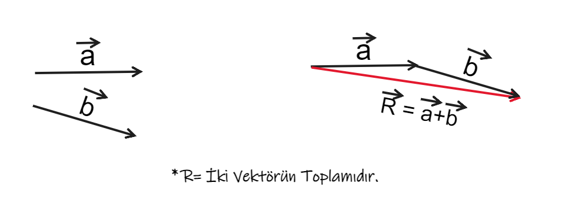
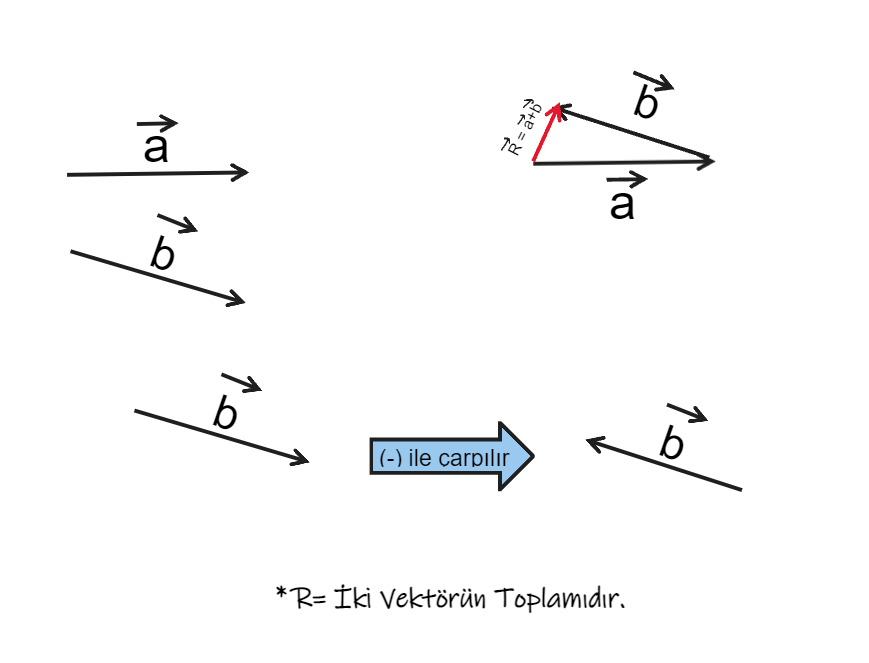
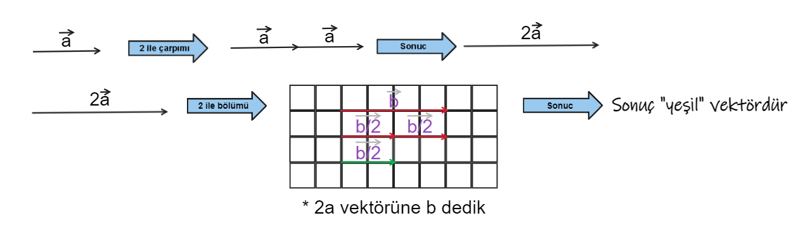

# Vektörde Sezgisel Matematik
 
 ## Sezgisel Matematik Nedir?
 
***Sezgisel matematik**, karmaşık matematiksel kavramları ve ilkeleri, katı biçimsel akıl yürütme yerine doğal içgüdüleri ve içgörüleri kullanarak anlama becerisini ifade eder. Basitçe söylemek gerekirse, adım adım prosedürlere güvenmek zorunda kalmadan hızlı hesaplamalar veya tahminler yapmanızı sağlayan sezgisel bir sayı ve mantık duygusudur. Pek çok insan, kafasında matematik yaptığını fark etmeden bu yeteneğe sahip olabilir! Sezgisel matematik, sayılar ve nesneler arasındaki kalıpları veya ilişkileri görselleştirmenin yanı sıra miktarları daha küçük, daha yönetilebilir parçalara bölerek yaklaşık değerler olarak gelebilir. Özünde, bireylerin sorunları yaratıcı bir şekilde çözmelerine olanak tanırken aynı zamanda formülleri ezberlemenin ötesinde matematiksel kavramlar hakkında daha derin bir anlayış kazanmalarına yardımcı olur. Doğuştan gelen bazı yetenekler sezgisel matematik becerilerinde rol oynayabilirken, herkes bu becerileri uygulama ve deneyim yoluyla geliştirebilir.*

## Vektörde Sezgisel Matematik

***Vektör matematiği**, fizik, mühendislik ve bilgisayar grafikleri dahil olmak üzere çok çeşitli uygulamalarda kullanılan matematiğin önemli bir dalıdır. **Vektörlerin sezgisel matematiği**, matematiksel problemleri çözmek için vektör cebirinin kullanılması için gerekli olan, vektörler ve fiziksel dünya arasındaki ilişkiyi anlama yeteneğidir. Özünde, vektörlerin sezgisel matematiği, 2B vektörleri, 3B vektörleri veya diğer herhangi bir vektör niceliğini belirli bir boyutta görselleştirme ve manipüle etme yeteneğidir.*

***Vektörler**, vektörün yönünü gösteren oklar olarak temsil edilebilir ve okun uzunluğu vektörün büyüklüğünü temsil eder. Vektörlerin sezgisel matematiği, karmaşık problemleri çözmek için gerekli olan toplama, çıkarma, çarpma ve bölme gibi vektörler üzerinde işlemler yapmamızı sağlar. Sonuç olarak, vektörlerin sezgisel matematiği, manipülasyon gerektiren uygulamalarda çok önemli bir rol oynar. Matematiğin bu dalı, karmaşık fiziksel olayları anlamak, sistemlerin davranışları hakkında matematiksel tahminler yapmak ve gerçek dünyada uygulanabilecek çözümler tasarlamak için vektörleri manipüle etmemize izin verir. Vektörlerin sezgisel matematiğini anlama yeteneği, fizik, mühendislik ve bilgisayar grafikleri dahil birçok alanda başarı için gereklidir.*

## Vektörde Dört İşlem

*Vektörler, büyüklüğü ve yönü olan geometrik nesnelerdir. **Toplama, çıkarma, skaler çarpma ve bölme** olmak üzere vektörler üzerinde yapılabilecek dört temel işlem vardır. **Vektör toplamada**, iki vektör toplandığında büyüklükleri ve yönleri birleştirilir. **Çıkarma** toplamaya benzer, ancak bir vektörün yönü toplamadan önce tersine çevrilir. Bu genellikle iki vektör arasındaki fark olarak adlandırılır.*

***Bir skaler k ile skaler çarpma**, bir vektörün her bir bileşenini k ile çarpar ve vektörün büyüklüğünü değiştirir. Yön aynı kalır. k negatif ise vektörün yönü de değişir. **Vektörde bölme**, bir vektörün skaler bir niceliğe bölünmesi işlemine atıfta bulunur; bu, vektörün büyüklük olarak küçülmesine ancak orijinal yönünü korumasına neden olur.*

### Vektörde Toplama:

### Vektörde Çıkarma:

### Vektörde Skaler Çarpma ve Bölme:

